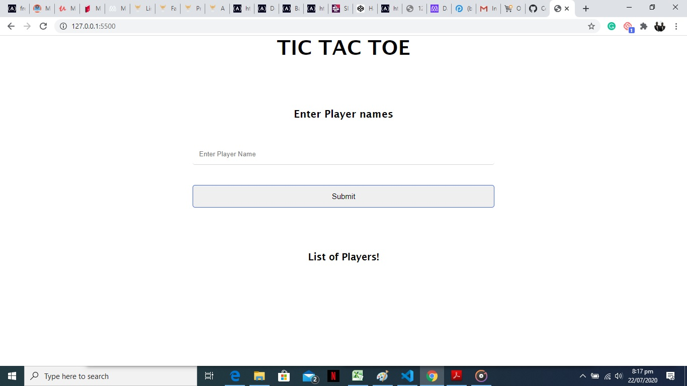

<!--
*** Thanks for checking out this README Template. If you have a suggestion that would
*** make this better, please fork the repo and create a pull request or simply open
*** an issue with the tag "enhancement".
*** Thanks again! Now go create something AMAZING! :D
-->

<!-- PROJECT SHIELDS -->
<!--
*** I'm using markdown "reference style" links for readability.
*** Reference links are enclosed in brackets [ ] instead of parentheses ( ).
*** See the bottom of this document for the declaration of the reference variables
*** for contributors-url, forks-url, etc. This is an optional, concise syntax you may use.
*** https://www.markdownguide.org/basic-syntax/#reference-style-links
-->

 

# javascript Tic tac toe

> In this project, we built a game called TIC TAC TOE. 
Where Users can:

- Introduce the name of the players.
- The game is played on a grid that's 3 squares by 3 squares.
- You are X, your friend is O. Players take turns putting their marks in empty squares.
- The first player to get 3 of their marks in a row (up, down, across, or diagonally) is the winner.
- When all 9 squares are full, the game is over. If no player has 3 marks in a row, the game ends in a tie

#  Screenshot

)

# Live Demo
[Live Demo Link](https://angry-borg-90b651.netlify.app/)

# Built With

- JavaScript
- HTML5
- CSS3

### Usage

- Created a AI to play with.

### Prerequisites

- A modern browser, up to date.

# Authors

## Author

👤 **Kelly Booster**

- Github: [@kelibst](https://github.com/kelibst)
- Twitter: [@keli_booster](https://twitter.com/keli_booster)
- Linkedin: [Kekeli (Jiresse) Dogbevi
](https://www.linkedin.com/in/kekeli-dogbevi-jiresse/)

👤 **Author2**
Aremu Lucky

- Github: [@githubhandle](https://github.com/Luckyaremu)
- Twitter: [@twitterhandle](@luckyaremu)
- Linkedin: [linkedin]()

# 🤝 Contributing
Contributions, issues and feature requests are welcome!

Feel free to check the issues page

# Show your support
Give a ⭐️ if you like this project!

This project is [MIT](lic.url) licensed.